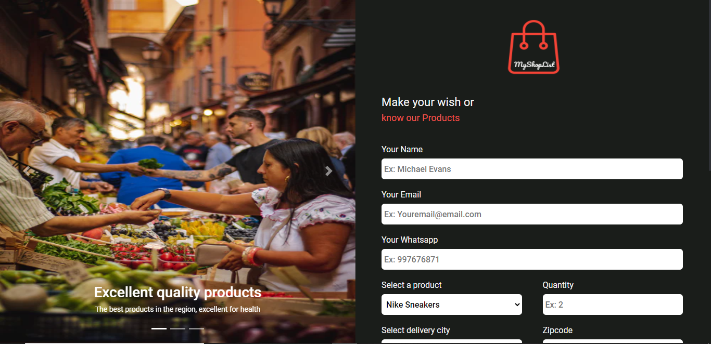
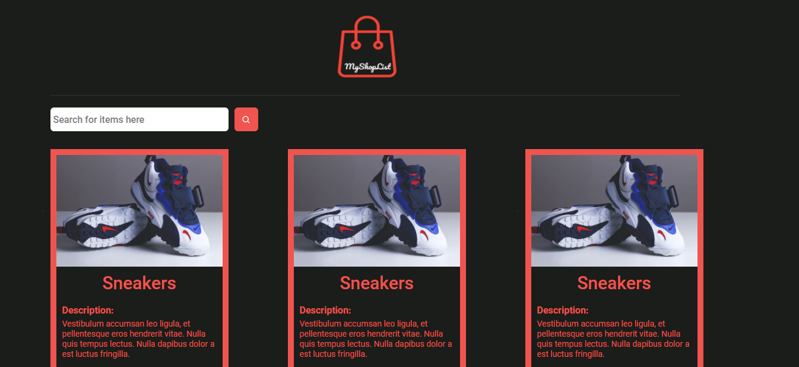
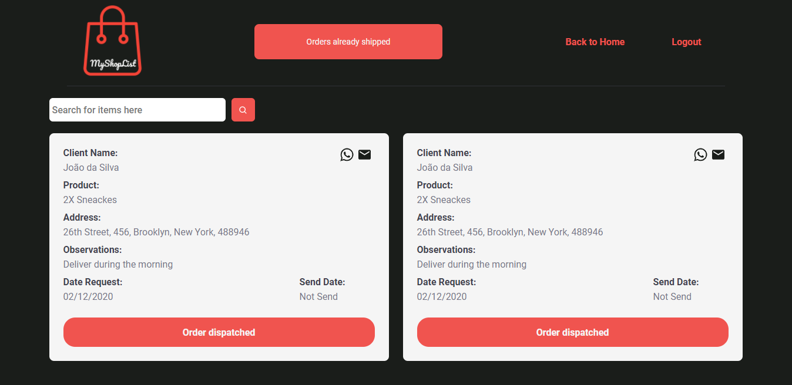

# Template-For-Meis
Template ReactJs de E-commerce para pequenas Lojas.

## Funcionalidades

- O template conta com a área de Adminstritração e Área de Usuário
- Validação de Formulário
- Totalmente Responsivo
- Carrousel feito com ReactStrap
- Styled-Components

## Links

- [Figma](https://www.figma.com/file/oGwhzFcRko3xDHozVqA1VG/Template-for-MEI-s?node-id=0%3A1)
- [Deploy](https://zen-brown-0d02b6.netlify.app/)

